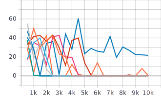
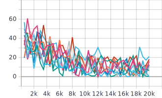

# PyTorch Lightning Neural Turing Machine (NTM)

This is a PyTorch Lightning implementation of the [Neural Turing Machine](https://arxiv.org/abs/1410.5401) (NTM).
For more details on NTM please see the paper.

## PyTorch Lightning

[Pytorch lightning](https://www.pytorchlightning.ai/) is the lightweight PyTorch wrapper. 
It organises your code neatly, abstracts away all the complicated and error prone engineering, is 
device agnostic while it still gives you all the flexibility of a standard PyTorch training procedure.

For more information on PyTorch Lightning, see the [documentation](https://pytorch-lightning.readthedocs.io/en/stable/).

## Repository Overview

This repository is a PyTorch Lighting conversion of [this](https://github.com/loudinthecloud/pytorch-ntm) PyTorch NTM implementation. 
We extend the available implementation with the LSTM network as baseline comparison. We can divide the repository in three main parts:
1. `run_train.py` is the Lightning trainer which runs the training loop and logs the outputs.
2. `data_copytask.py` is the Lightning dataset for the copy task in the original paper. We do not implement the copy-repeat task but this could be done similar to the original PyTorch repository.
3. `model.py` is the Lightning model which specifies the training and validation loop. Within this model we call the different models which are:
- `model_ntm.py` which is the NTM implementation. The remaining files are in the folder `ntm/*`. This is a copy of the files from the original repository. Credits go to these authors.
- 'model_lstm.py' which is the LSTM baseline implementation.

Note that we are generating training and validation sequences on the fly for each epoch differently.

## Usage

Setup the environment
```bash
pip install -r requirements.txt
```

To run a model, call
```bash
python run_train.py --model MODELNAME
```
with MODELNAME either ntm or lstm.

You can add any number of Lightning specific options e.g.
```bash
python run_train.py --model ntm --gpus 1 --fast_dev_run True
```
runs the ntm model on a single GPU but it only does one fast test run to check all parts of the code.

## Results

In this part we present some results that we obtained for the copy task. 
The goal of the copy task is to test the ability to store and remember arbitrary long sequences. 
The input is a sequence random length (between 1 and 20) with a given number of bits (8) followed by a delimiter bit.
E.g. we may obtain an input sequence of 20 by 8 which we want to store and remember at the output.

We run both networks over 10 seeds using the bash command `multiple_train.sh`. See the options within the scripts for
the exact training options used in our scenario. Note that we use a batch size of 8 to speed up training compared to a 
batch size of 1 in the original paper. We show mean and std values for training and validation data.


The individual validation costs are given by the following figures. Top is for NTM and bottom for LSTM.



